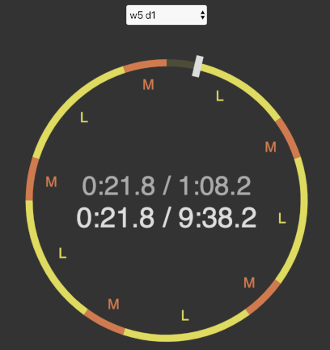

# Exercise Metronome

## Motivation

So, I have the cheapest Decathlon ergometer, which comes with no metrics whatsoever.
Attempted several approaches to help me train prior to this one (measure accelerometer, blob detection with computer vision, etc.)
Ended up reversing it: using a metronome to keep a steady pace during each session step.

This app does a relatively simple job:

- holds a set of exercises which one can use over the course of 8 weeks (or extend/customize)
- displays session and part times (Canvas API)
- plays a ticking sound to aid one keep the scheduled pace (Web Audio + timer running on a worker)
- says out loud relevant transition events (Speech Synthesis API)

It works reasonably well. Allows one to keep focused on the session with low cognotive effort.

## Rowing

You one the browser page, pick the exercise from the select box.
Once ready hit space of touch/click to start/pause the session.
There are 4 kinds of activity:

- **L** - low intensity rowing (20 strokes per minute)
- **M** - medium intensity rowing (23 spm)
- **H** - high intensity rowing (26 spm)
- **R** - rest

Whenever you enter on a new part of the session, coach calls it out and tweaks the metronome (each stroke does a low and a high tick so you sync with your movement).  
That's it!

<video src="public/rowing-demo.mp4" controls></video>

[use it now](https://josepedrodias.github.io/exercise-metronome/rowing.html)

## 7 min workout and other routines

Haven't funny fleshed out this one.

## TODO

- halfway there, 3, 2, 1... at end of step
- 3, 2, 1... before session
- fix change program / play after ending
- write some intro
- 7 min exercise variant?
  - custom step rpms and durations
  - change step speed during session and record it
  - shuffle steps
